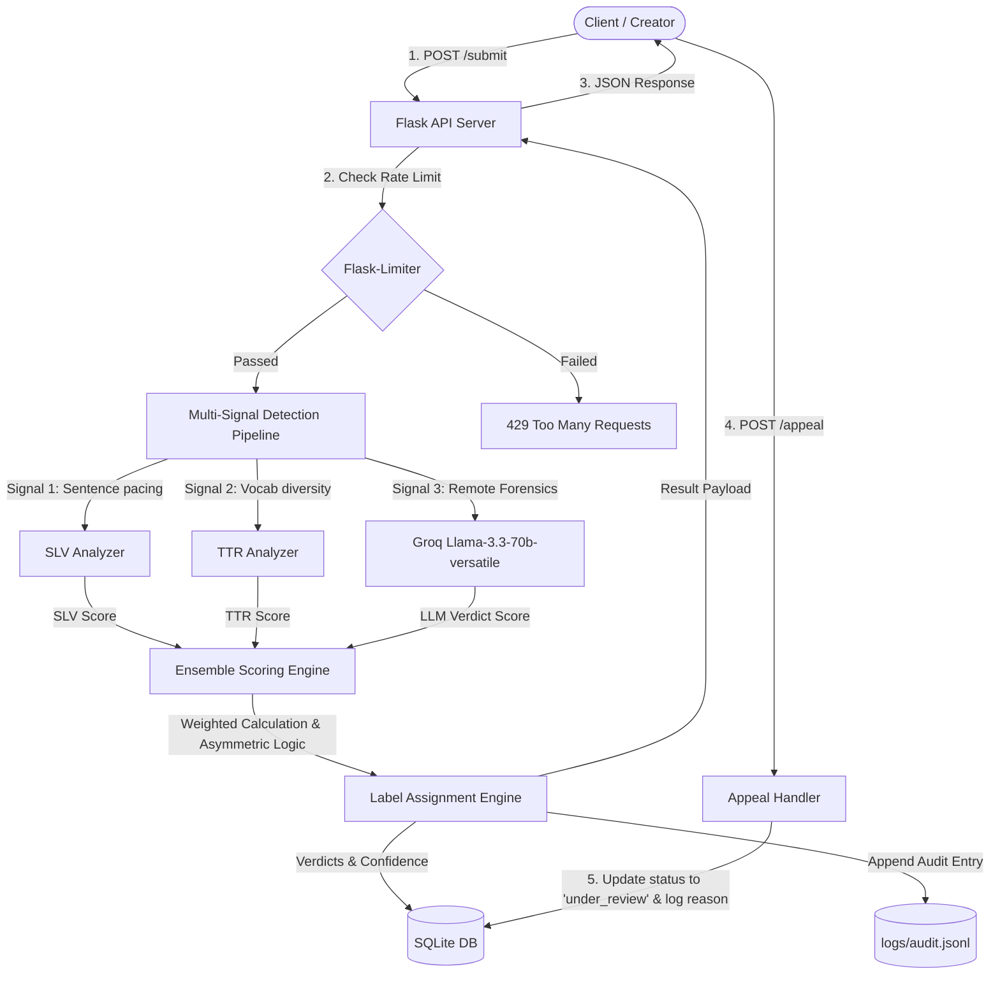

# Provenance Guard Planning Document

## Architecture

Provenance Guard is structured as a Flask-based backend containing a multi-signal detection pipeline, a persistent SQLite database for audit trails and appeals, and a rate-limiting layer.

### System Diagram

### Architecture Narrative
* **Submission Flow:** The client submits content to `POST /submit`. If the request passes the rate limiter, the pipeline calculates stylometric heuristics (SLV and TTR signals) and queries Llama-3.3 via Groq. The engine aggregates the 3 signals, maps them to a transparency label, stores the transaction in SQLite and the JSONL log, and returns the verdict. If verified creator credentials are provided, a Provenance Certificate is issued immediately.
* **Appeal Flow:** The client contests a decision via `POST /appeal`. The server updates the database status of that submission to `"under_review"` and appends the event to the JSONL log, ensuring subsequent lookups display a neutral status to protect the author.

---

## Detection Signals (Ensemble Strategy)

Provenance Guard uses **three distinct signals** to identify content authorship:

### Signal 1: Sentence Length Variance (SLV) (Structural)
* **What it measures:** The statistical variance ($\sigma^2$) of the word count per sentence.
* **Why it differs:** Humans naturally mix short, punchy statements with complex compound clauses. AI text favors highly uniform lengths to maintain smooth phrasing, yielding very low variance.
* **Blind Spots:** Extremely short texts where sentence count is too low to extract meaningful variance.

### Signal 2: Type-Token Ratio (TTR) (Structural)
* **What it measures:** The ratio of unique words (Types) to total words (Tokens) to capture vocabulary diversity.
* **Why it differs:** Humans make eccentric, creative vocabulary choices. AI systems predict top-probability tokens, repeating grammatical connectors and standard terms frequently.
* **Blind Spots:** Repetitive human literary structures (like poetry refrains or villanelles) which lower TTR naturally.

### Signal 3: Forensic Linguistic Analysis (LLM Analysis)
* **What it measures:** Use of stylistic clichés (*delve, tapestry, testament, furthermore, critical, crucial*), predictable paragraph flows, and flat tone.
* **Why it differs:** AI follows generic web training patterns. Humans write with eccentric voices, local context, and grammatical colloquialisms.
* **Blind Spots:** Translations and highly edited academic papers.

---

## Uncertainty Representation & Score Calibration

* **What a score of 0.6 means:** 
  A combined score of `0.6` represents **Uncertainty**. It indicates conflicting metrics (e.g. LLM flags a text as AI-generated, but structural sentence patterns are highly variable and human-like). Rather than forcing a binary answer, the system assigns the `Uncertain` label, keeping the creator label neutral.
* **Ensemble Weighting Formula:**
  * **Short Text (< 50 words):** Heuristics are ignored due to volatility.
    $$\text{Combined Score} = \text{LLM Score}$$
  * **Long Text ($\ge 50$ words):**
    $$\text{Combined Score} = 0.15 \times \text{SLV Score} + 0.15 \times \text{TTR Score} + 0.70 \times \text{LLM Score}$$
* **Calibration Thresholds:**
  * **Likely Human:** $\text{score} < 0.40$
  * **Uncertain:** $0.40 \le \text{score} \le 0.80$
  * **Likely AI:** $\text{score} > 0.80$

---

## Transparency Label Design (Verbatim Texts)

* **High-Confidence Human:**
  > `"This work is classified as human-authored. Our analysis suggests a high probability of original human creation."`
* **Uncertain:**
  > `"This work has mixed stylistic markers. Our analysis is unable to determine the origin with high confidence, so the author's original attribution is displayed."`
* **High-Confidence AI:**
  > `"This work is flagged as AI-generated. Our analysis detected patterns highly consistent with artificial intelligence writing tools."`
* **Provenance Certificate (Verified Human Creator):**
  > `"Verified Human Creator Certificate: This content has been verified as original human writing by a certified author."`

---

## Appeals Workflow

* **Who can appeal:** Only the creator associated with the `author_id` of the original submission.
* **Information provided:** The original `submission_id` and a written text reasoning.
* **System Actions upon Receipt:**
  1. Validates the existence of the `submission_id`.
  2. Updates the SQL database record's `status` to `"under_review"` and saves the `appeal_reason`.
  3. Appends an `"appeal"` event record containing the reason to `logs/audit.jsonl`.
* **Human Reviewer Interface Queue:**
  A moderator querying the admin endpoint receives a structured JSON queue containing all submissions where `status = 'under_review'`. They can inspect:
  * The raw content and title.
  * The individual Signal 1 (SLV), Signal 2 (TTR) and Signal 3 (LLM) scores.
  * The creator's appeal reason.

---

## Anticipated Edge Cases

1. **Repetitive Poetry (e.g., Villanelles or Ballads):**
   * *Description:* Human-written poems featuring refrains and highly structured lines (e.g., Edgar Allan Poe's "The Raven").
   * *Failure Mode:* The repeating phrases severely reduce the Type-Token Ratio (TTR) and sentence length variance, causing heuristics to flag the poem as AI.
   * *Mitigation:* The ensemble weights the LLM semantic signal higher, and the appeal status quickly neutralizes false classifications.
2. **Structured Software Code Explanations:**
   * *Description:* Technical documentation detailing code snippets in step-by-step guides.
   * *Failure Mode:* Explanations often use repetitive, dry, and structured verbs (e.g., "Implement the following function. Next, compile the code.").
   * *Mitigation:* The system uses the `Uncertain` buffer to prevent immediate flagging, allowing users to submit appeals.

---

## Stretch Features Design

### 1. Ensemble Detection (3+ Signals)
We split stylometric calculations into two distinct structural scores (SLV score and TTR score) rather than averaging them into a single heuristic value. This allows the combined engine to weigh vocabulary choices and sentence structures independently alongside the forensic LLM score.

### 2. Provenance Certificate
* **Verification Step:** Authors earn certificates by presenting a verified creator token (`token_verified_human_123`) during submission (linked to authentication checks).
* **Display Format:** Overrides standard classification labels, displaying the `"Verified Human Creator Certificate..."` badge.

### 3. Analytics Dashboard
Exposes a `GET /analytics` endpoint returning aggregate JSON payloads:
* `verdict_distribution`: Ratio of human vs. AI vs. uncertain outcomes.
* `appeal_rate`: Percentage of submissions appealed.
* `total_submissions`: Submissions volume.
* `active_appeals_count`: Submissions pending moderator review.
* `provenance_certificates_issued`: Certificates granted.

### 4. Multi-Modal alt-text / Image Descriptions Support
* **Concept:** When `"content_type": "metadata"` is passed, the engine recognizes the text represents image alt text or descriptions.
* **Pipeline Adjustment:** Queries Groq with a specialized prompt looking for machine clichés (e.g. starting with *"This photo displays..."* or listing irrelevant background objects) and adapts heuristics thresholds.

---

## AI Tool Plan

### M3 (Submission Endpoint + Heuristics Signal)
* **Spec Sections Provided:** `Architecture` (diagram + narrative) + `Detection Signals` (Signal 1 & 2 Heuristics specifications).
* **AI Generation Request:** Generate the Flask application skeleton, configure routing, implement python-based functions for Sentence Length Variance, Type-Token Ratio, and Punctuation Density, and write local tests.
* **Verification Method:** Run unit tests against known inputs (e.g. texts of uniform length to assert SLV = 0) before integrating the second signal.

### M4 (Second Signal + Confidence Scoring)
* **Spec Sections Provided:** `Detection Signals` (Signal 3 LLM specifications) + `Uncertainty Representation & Score Calibration` + `Architecture` (system diagram).
* **AI Generation Request:** Integrate the Groq Llama-3.3-70b-versatile client with JSON mode. Implement the short-text override and the weighted ensemble scoring math.
* **Verification Method:** Compare scores of a known human-written blog post against an AI-generated essay, validating that the final combined scores fall into the expected ranges.

### M5 (Production Layer & Stretch Features)
* **Spec Sections Provided:** `Transparency Label Design` + `Appeals Workflow` + `Stretch Features Design` + `Architecture` (system diagram).
* **AI Generation Request:** Implement Flask-Limiter configurations, SQLite database status update query actions for `/appeal`, `/analytics` aggregation queries, JSONL file appending, and custom Flask 429 error handlers.
* **Verification Method:** Loop sequential curl requests to trigger `429 Too Many Requests`. Run mock appeals to verify database status transitions to `"under_review"`. Query `/analytics` to verify correct distribution ratios.
