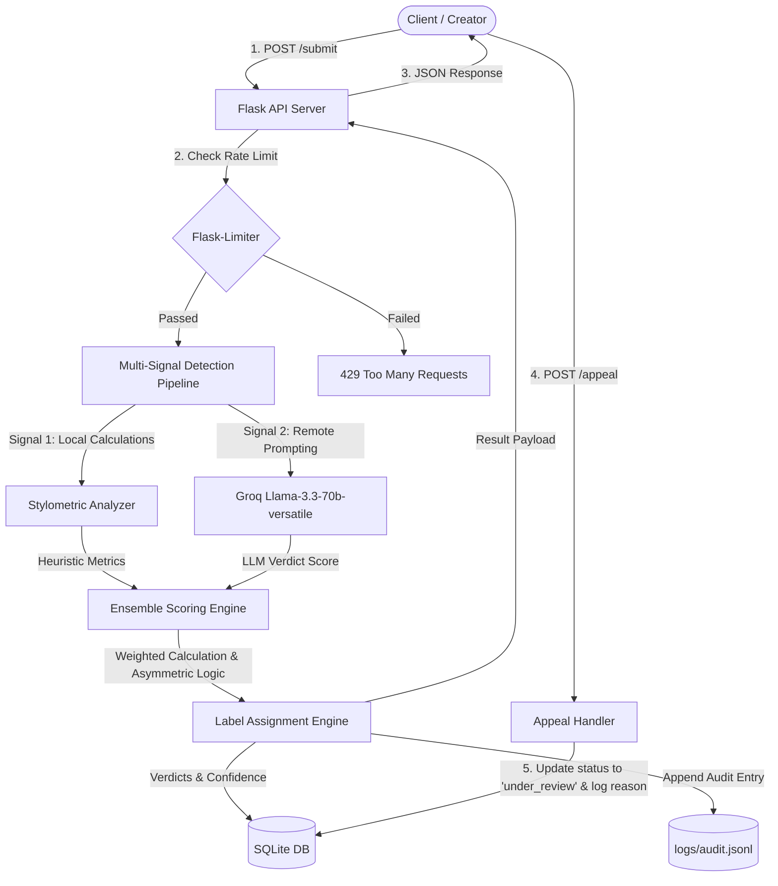

# Provenance Guard Planning Document

## Architecture

Provenance Guard is structured as a Flask-based backend containing a multi-signal detection pipeline, a persistent SQLite database for audit trails and appeals, and a rate-limiting layer.

### System Diagram



### Architecture Narrative
1. **Request Intake:** A creator submits text via `POST /api/v1/submit`.
2. **Rate Limiting:** The request passes through `Flask-Limiter` configurations, ensuring request frequency is within acceptable bounds.
3. **Pipeline Orchestration:** `detector.py` invokes two distinct signals:
   - **Signal 1 (Stylometric Heuristics):** Calculates Sentence Length Variance (SLV) and Type-Token Ratio (TTR) directly in Python.
   - **Signal 2 (Groq LLM):** Querying Llama-3.3-70b-versatile to examine the prose for clichéd structures, high-probability token groupings, and uniformity.
4. **Aggregation & Verdict:** The engine combines the signals, applies threshold categorization, generates the appropriate user-facing label text, writes the audit logs (to SQLite database and `logs/audit.jsonl`), and returns the response.
5. **Appeal Lifecycle:** If the client submits `POST /api/v1/appeal`, the database is queried, the item's status is changed to `"under_review"`, and the audit trail is updated. Subsequent reads will return a neutral "Under Review" status to users.

---

## Detection Signals

### Signal 1: Stylometric Heuristics (Structural Analysis)
* **What it measures:** 
  1. **Sentence Length Variance (SLV):** The statistical variance ($\sigma^2$) of the word count per sentence.
  2. **Type-Token Ratio (TTR):** The ratio of unique words to total words.
* **Why it differs between Human and AI:**
  * **Sentence Length:** Human writers naturally use a dynamic mix of short, punchy sentences and long, descriptive, compound sentences. AI models prefer uniform sentence lengths (usually 12-18 words) to maintain a smooth, readable flow. Therefore, human writing has high SLV, while AI text has low SLV.
  * **Vocabulary Diversity:** Human writing features eccentric vocabulary, slang, and contextual repetition patterns, whereas AI models tend to use common, safe, highly probable words, leading to a lower TTR.
* **Blind Spots:**
  * **Very Short Text:** For text shorter than 50 words, statistical calculations like SLV and TTR lose significance (high error variance).
  * **Prompt-Engineered AI:** A sophisticated prompt instructing an AI to write with "highly varied sentence structures and quirky vocabulary" can inflate SLV and TTR.

### Signal 2: Forensic Linguistic Analysis (LLM Analysis)
* **What it measures:** Use of stylistic clichés (*delve, testament, tapestry, explore, furthermore*), paragraph structure predictability, and semantic depth.
* **Why it differs between Human and AI:**
  * AI text is generated token-by-token based on average patterns across the web, making its semantic transitions and analogies extremely predictable and "standardized." Humans write with personal voice, logical leaps, and unconventional structuring.
* **Blind Spots:**
  * **Highly Edited Human Prose:** A highly edited academic article or legal text can look exactly like an AI's structured, formal response.
  * **Translations:** Humans translating original work word-for-word may construct semantic flows that appear rigid or unnatural to an LLM evaluator.

---

## False Positive Strategy (Asymmetric Design)

* **Asymmetric Confidence Weighting:** The classification rules favor human attribution because a false positive (flagging a human's original work as AI) is far more damaging than a false negative.
* **Score Calibration:** 
  * If the combined confidence score is high ($> 0.80$), it receives the **High-Confidence AI** label.
  * If the combined score is low ($< 0.40$), it receives the **High-Confidence Human** label.
  * If the combined score is in the middle ($0.40 \le \text{score} \le 0.80$), the system assigns the **Uncertain** label, protecting the user from an false AI accusation.
* **Neutralizing Status on Appeal:** As soon as an appeal is filed, the state changes to `"under_review"` which hides any AI label, displaying a neutral "Under Review" notice to avoid reputation damage during verification.

---

## API Surface

### 1. Submit Content
* **Endpoint:** `POST /api/v1/submit`
* **Request Format:**
  ```json
  {
    "author_id": "creator_123",
    "title": "My Short Story",
    "content": "The old house stood silently on the hill..."
  }
  ```
* **Success Response (201 Created):**
  ```json
  {
    "submission_id": "sub_abc123",
    "classification": "human" | "uncertain" | "ai",
    "confidence_score": 0.12,
    "label_text": "This work is classified as human-authored.",
    "status": "active"
  }
  ```

### 2. Submit Appeal
* **Endpoint:** `POST /api/v1/appeal`
* **Request Format:**
  ```json
  {
    "submission_id": "sub_abc123",
    "reason": "This is entirely my own original writing."
  }
  ```
* **Success Response (200 OK):**
  ```json
  {
    "submission_id": "sub_abc123",
    "status": "under_review",
    "message": "Appeal successfully logged. Content is now under review."
  }
  ```

### 3. Retrieve Logs
* **Endpoint:** `GET /api/v1/logs`
* **Success Response (200 OK):**
  ```json
  {
    "logs": [
      {
        "id": 1,
        "submission_id": "sub_abc123",
        "timestamp": "2026-07-05T14:15:00",
        "author_id": "creator_123",
        "title": "My Short Story",
        "content_preview": "The old house stood...",
        "heuristic_score": 0.15,
        "llm_score": 0.08,
        "combined_score": 0.11,
        "classification": "human",
        "status": "active",
        "appeal_reason": null
      }
    ]
  }
  ```
